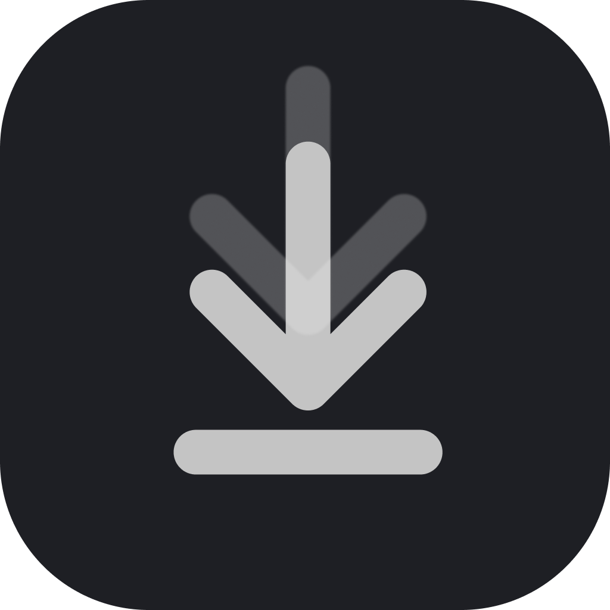
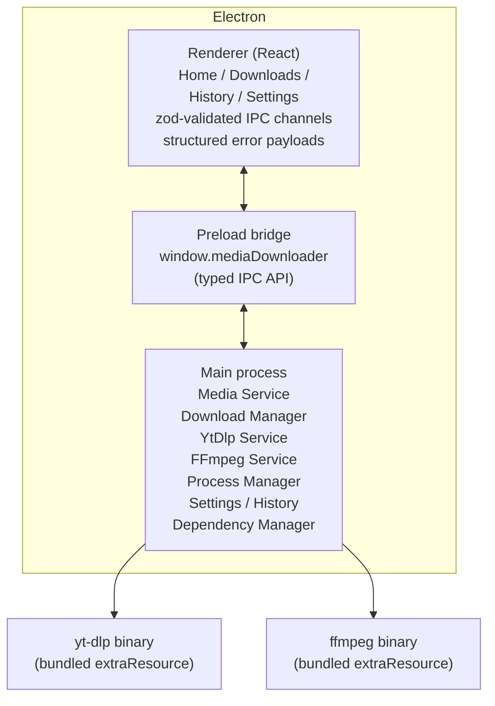

<div align="center">



# EasyDownload

**A local-first desktop media downloader built with Electron, React, and TypeScript.**

Paste a video or playlist URL, pick a quality, and download directly to your device —
with a queue, pause/resume, automatic retry, playlist support, media conversion, and
persistent history. Powered by bundled yt-dlp and FFmpeg binaries.

[](https://github.com/Abo3baziz/EasyDownload/releases/latest)
[](https://www.codebyahmed.online/)
[](https://github.com/Abo3baziz)

[Download](https://github.com/Abo3baziz/EasyDownload/releases/latest) ·
[Features](#features) ·
[How it works](#how-it-works) ·
[Development](#development) ·
[case study](docs/PORTFOLIO.md)

</div>

---

## Why EasyDownload?

- **No third-party upload services.** Everything runs on your device — no accounts, no cloud, no pasting your links into someone's website.
- **Nothing to install or configure.** yt-dlp (downloading) and FFmpeg (processing) are bundled inside the installer.
- **Friendly on top of powerful.** A clean GUI manages the whole lifecycle of the raw download engine: inspection, queueing, retries, history, and conversions.

## Features

- **Inspect before downloading** — see title, thumbnail, duration, and every available quality labeled like "1080p MP4" before committing bandwidth.
- **Download queue with adjustable concurrency** — run 1–10 downloads at once; finishing, cancelling, failing, or pausing one automatically starts the next.
- **Pause / resume / cancel / retry** — pause keeps partial files and resumes where it left off; retry works even for entries restored from history after a restart.
- **Automatic transient-failure retry** — rate-limit and network errors (HTTP 403/429/5xx, connection resets) are retried up to four times with escalating backoff (2s/4s/8s/16s); permanent failures never are.
- **Playlist downloads** — paste a playlist link, choose a quality preset (Best / 1080p / 720p / 480p / 360p / Audio), and every entry is queued into a playlist folder with aggregate progress, per-playlist serialization to avoid rate limits, group cancel, and skip-already-downloaded.
- **Conversion & audio extraction** — turn finished downloads into MP4/MKV or extract MP3/AAC/Opus/FLAC audio through a concurrency-limited conversion queue.
- **Persistent history** — downloads and inspected URLs survive restarts, grouped by day with thumbnails, file sizes, per-entry delete, and clear-all.
- **Duplicate protection** — downloading the same video in the same format twice is rejected with a clear message.
- **Desktop notifications** — optional completion/failure notifications.

## Download

Grab the latest Windows installer from the
[Releases page](https://github.com/Abo3baziz/EasyDownload/releases/latest).
The release workflow runs typecheck plus the full test suite, packages the NSIS
installer with yt-dlp and FFmpeg bundled, and attaches it to the release.

macOS (DMG) and Linux (AppImage) packaging is configured (`npm run dist:mac` /
`dist:linux`) but not yet part of automated releases.

## How it works



- Every renderer request crosses a strict [zod](https://zod.dev)-validated IPC channel and returns a structured `IpcResult` — never raw exceptions.
- External tools run as `spawn(executable, args[])`; URLs, format IDs, filenames, and paths are treated as untrusted input.
- Downloads, settings, inspections, and conversions persist locally as JSON written atomically (temp file + rename) with backup recovery.
- The interface is sandboxed away from Node.js: `contextIsolation: true`, `nodeIntegration: false`, and a minimal typed preload API.

For the full architecture walkthrough — including design decisions, security model,
and engineering challenges solved — read the
[portfolio case study](docs/PORTFOLIO.md) and the [ADR index](docs/ADR/README.md).

## Development

Requires **Node.js ≥ 20**.

```bash
npm install

npm run dev          # start electron-vite dev with hot reload
npm test             # unit + integration + renderer tests
npm run typecheck    # tsc for node and web configs

npm run dist:win     # package a Windows installer (fetches yt-dlp/ffmpeg first)
npm run dist:mac     # macOS DMG
npm run dist:linux   # Linux AppImage
```

### Project structure

```
src/
  main/       Electron main process: IPC handlers, services
              (download, conversion, media, ytdlp, ffmpeg, process,
               settings, history, filesystem, dependencies, notifications)
  preload/    Typed context-bridge API exposed to the renderer
  renderer/   React UI: pages, components, state providers, hooks
  shared/     Types, zod schemas, constants, utilities shared by both worlds
docs/         Requirements, architecture, testing strategy, ADRs, case study
tests/        Integration tests (real child processes)
```

### Testing

The suite covers services and UI at three levels — unit (services, managers, shared
utilities), integration (real spawned processes), and renderer (React Testing Library):

```bash
npm run test:unit
npm run test:integration
npm run test:renderer
```

## Documentation

| Document | Contents |
| --- | --- |
| [`docs/REQUIREMENTS.md`](docs/REQUIREMENTS.md) | Product requirements and supported behavior |
| [`docs/ARCHITECTURE.md`](docs/ARCHITECTURE.md) | Layering, module boundaries, request flow |
| [`docs/TESTING.md`](docs/TESTING.md) | Test strategy and how tests are run |
| [`docs/ADR/`](docs/ADR/README.md) | Architecture decision records |
| [`docs/PORTFOLIO.md`](docs/PORTFOLIO.md) | Full project case study |
| [`CHANGELOG.md`](CHANGELOG.md) | Release history |
| [`docs/tasks/index.md`](docs/tasks/index.md) | Engineering task tracker |

## Portfolio

This project is documented end-to-end as a portfolio case study — covering the problem,
solution, architecture, key features, engineering decisions, challenges and solutions,
security model, testing, and deployment:

📖 **[Read the full case study →](docs/PORTFOLIO.md)**

More of my work lives on my GitHub profile: [@Abo3baziz](https://github.com/Abo3baziz)

## License

UNLICENSED — all rights reserved. See [`package.json`](package.json).
