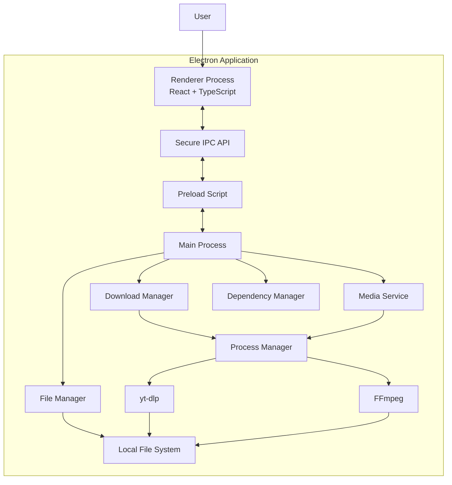
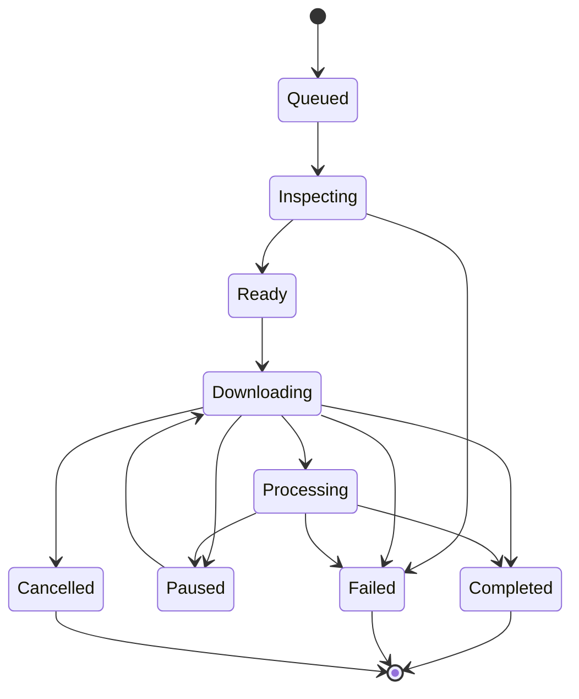
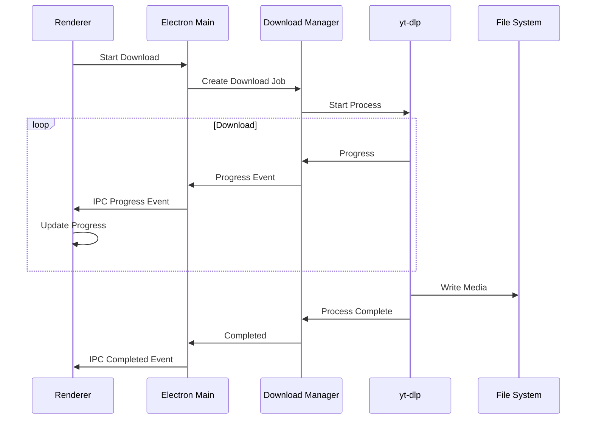
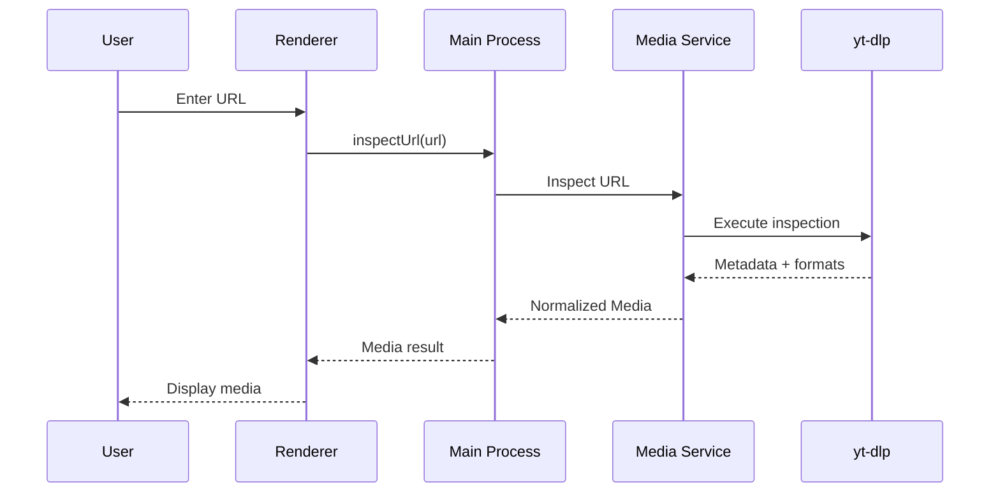
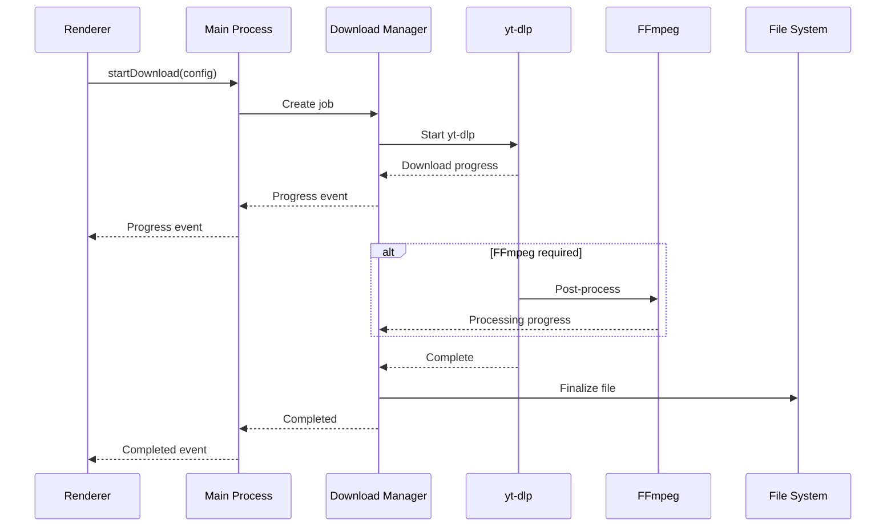
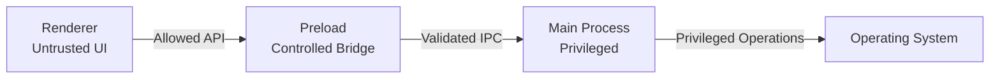

# Architecture — EasyDownload

## 1. Purpose

This document defines the technical architecture of the EasyDownload desktop application.

It describes:

* Application structure.
* Electron process boundaries.
* Renderer/Main/Preload responsibilities.
* IPC communication.
* Download lifecycle.
* yt-dlp integration.
* FFmpeg integration.
* Filesystem interaction.
* Dependency management.
* Error handling.
* Security boundaries.
* Cross-platform considerations.
* Future Chrome extension integration.

This document defines **how the application is built**.

Product behavior and feature requirements are defined in:

```text
docs/REQUIREMENTS.md
```

---

# 2. Architecture Goals

The architecture should prioritize:

1. Local-first processing.
2. Clear separation between UI and privileged operations.
3. Secure Electron architecture.
4. Isolated yt-dlp integration.
5. Isolated FFmpeg integration.
6. Reliable process management.
7. Responsive UI during downloads.
8. Cross-platform compatibility.
9. Extensibility for future browser integration.
10. Maintainability and testability.
11. Minimal infrastructure requirements.

---

# 3. High-Level Architecture

The application is a desktop application built with Electron.



---

# 4. Core Architecture Principle

The application follows a **privileged-core + unprivileged-UI** model.

```text
Renderer
   │
   │ controlled IPC
   ▼
Preload
   │
   ▼
Main Process
   │
   ├── Services
   ├── Process Management
   ├── Filesystem
   └── Native APIs
```

The renderer must never directly access privileged operating-system functionality.

---

# 5. Electron Process Architecture

Electron provides three primary layers in this application:

```text
┌────────────────────────────────────┐
│ Renderer Process                   │
│ React + TypeScript                 │
│                                    │
│ UI / State / Presentation          │
└─────────────────┬──────────────────┘
                  │
                  │ IPC
                  ▼
┌────────────────────────────────────┐
│ Preload                            │
│                                    │
│ Controlled Renderer API            │
└─────────────────┬──────────────────┘
                  │
                  │ IPC
                  ▼
┌────────────────────────────────────┐
│ Main Process                       │
│                                    │
│ Application / Native Services      │
└────────────────────────────────────┘
```

---

# 6. Renderer Process

## Responsibilities

The renderer is responsible for:

* React UI.
* User interaction.
* Application screens.
* Client-side UI state.
* Download display.
* Media metadata presentation.
* Format selection UI.
* Progress visualization.
* Error presentation.
* Application settings UI.

## Restrictions

The renderer must not:

* Spawn operating-system processes.
* Execute yt-dlp.
* Execute FFmpeg.
* Access the filesystem directly.
* Use Node.js filesystem APIs.
* Use unrestricted Electron APIs.
* Construct shell commands.

The renderer communicates with the main process exclusively through the exposed preload API.

---

# 7. Preload Layer

The preload script acts as a security boundary between the renderer and Electron's privileged APIs.

Conceptually:

```text
React
  ↓
window.mediaDownloader
  ↓
Preload
  ↓
IPC
  ↓
Main
```

The preload layer should expose a minimal and explicit API.

Example:

```text
window.mediaDownloader.inspectUrl()
window.mediaDownloader.startDownload()
window.mediaDownloader.downloadPlaylist()
window.mediaDownloader.cancelPlaylist()
window.mediaDownloader.cancelDownload()
window.mediaDownloader.selectDirectory()
window.mediaDownloader.openFile()
window.mediaDownloader.openDirectory()
window.mediaDownloader.clearHistory()
window.mediaDownloader.onDownloadProgress()
window.mediaDownloader.startConversion()
window.mediaDownloader.onConversionStateChange()
window.mediaDownloader.listInspectionHistory()
window.mediaDownloader.deleteInspectionHistoryEntry()
window.mediaDownloader.onInspectionHistoryChange()
window.mediaDownloader.onInspectionHistoryDeleted()
```

The exact API is subject to implementation.

The preload layer must not expose:

```text
ipcRenderer
shell
fs
child_process
process
require
```

directly to the renderer.

---

# 8. Main Process

The Electron main process is the privileged application layer.

It is responsible for:

* Application lifecycle.
* Browser window creation.
* IPC handlers.
* Native dialogs.
* Filesystem operations.
* Child process management.
* yt-dlp execution.
* FFmpeg execution.
* Download management.
* Dependency management.
* Opening files/directories.
* Application-level configuration.

The main process should delegate functionality to dedicated services rather than becoming a large monolithic module.

---

# 9. Application Services

The main process should contain separate services with clear responsibilities.

Suggested conceptual structure:

```text
Main Process
│
├── Download Manager
│
├── Media Service
│
├── Process Manager
│
├── File Manager
│
├── Dependency Manager
│
├── Settings Manager
│
├── History Manager
│
├── Inspection History Manager
│
├── Notification Manager
│
├── FFmpeg Service
│
└── Conversion Manager
```

The Notification Manager owns desktop notifications (FR-015). It observes the Download Manager's update stream and, when notifications are enabled in settings, surfaces download completion and failure to the user. Notification behavior is isolated from the core download workflow: the Download Manager is unaware of notifications, and notification failures are swallowed so they never affect downloads.

The Inspection History Manager records every successful URL inspection as a persistent, offline-available history entry (URL, thumbnail reference, operation, absolute timestamp) using the shared JSON store (`inspection-history.json` in the user data directory). History keeps at most one entry per normalized URL (`normalizeUrl`): re-inspecting an existing URL refreshes that entry (new timestamp, updated thumbnail) instead of creating a duplicate, and legacy duplicate records are pruned to the newest one when loading. History is a rolling 30-day window: entries older than 30 days are pruned automatically whenever the store is loaded (app start, History section load) or a new entry is added, so the oldest entries are removed first as newer ones arrive; pruning is persisted (with the same rollback-and-report behavior on failure) and broadcast through the deletion event so open windows drop expired entries immediately. It lazy-loads persisted entries, saves new entries before surfacing them, and broadcasts each new or refreshed entry over IPC so the sidebar History section updates live without an app restart. Entries can be removed individually by id: the manager deletes the entry, persists the remaining list (rolling back and reporting failure if persistence fails), and broadcasts a deletion event so open windows drop the entry immediately. Persistence failures are logged and never break the inspection flow, and a missing or remote thumbnail never prevents an entry from being stored.

The FFmpeg Service wraps the FFmpeg executable for merge, convert, and audio-extraction operations. See section 13.

The Conversion Manager runs post-download conversions (convert / audio extraction) on completed files using the FFmpeg Service, tracking per-operation progress and state and broadcasting updates over IPC. See section 13.

---

# 10. Download Manager

The Download Manager is responsible for the lifecycle of downloads.

Responsibilities:

* Create download jobs.
* Maintain the download queue.
* Track download state.
* Start downloads.
* Cancel downloads.
* Pause and resume downloads.
* Retry failed or cancelled downloads.
* Track progress.
* Handle completion.
* Handle failure.
* Record download history.
* Capture the final downloaded file path deterministically, even when the process output changes.
* Coordinate yt-dlp and FFmpeg.
* Notify the renderer about state changes.

The Download Manager also owns **playlist downloads** (FR-020). A playlist is not a separate download entity: `downloadPlaylist` enumerates the playlist entries through the yt-dlp service (`--flat-playlist` inspection), then fans each entry out into an ordinary `Download` job tagged with optional `playlistId`, `playlistTitle`, `playlistIndex`, and `playlistCount` fields plus a quality `preset`. Because format IDs vary per video, playlist jobs do not carry a concrete format ID at creation; when a job executes, it re-inspects its entry, resolves the concrete format from the preset via `resolvePlaylistFormat`, and stores it on the record so retries reuse it. Entries are saved into a sanitized subfolder `<playlist title> [<playlist id>]` of the configured download directory, and each record's `directory` is that subfolder, so file actions, conversions, path repair, and pruning work unchanged. Entries already completed (by normalized URL) or duplicated within the playlist are skipped and reported in the result. Each entry remains an independent job: failures mark only that entry, the queue and concurrency limit apply normally, and `cancelPlaylist` cancels all non-terminal jobs sharing the playlist id. Playlist-tagged downloads do not trigger individual desktop notifications.

The final file path is captured through yt-dlp's `--print after_move:filepath` output (a bare absolute path printed on stdout after post-processing), with the `[download] Destination:` and `[Merger]` output lines kept as fallbacks for paused and cancelled downloads. When a completed download still has no captured path, the manager derives it from the known output template parts (directory, title, media id, format id, extension) and stores it only after verifying the file exists. On history load, completed records missing a path are backfilled by scanning their download directory for a uniquely matching file, so file actions (Open file, Open File Location, conversions) remain available for records created before these safeguards.

Example lifecycle:



---

# 11. Media Service

The Media Service provides media inspection functionality.

Responsibilities:

* Validate media URL.
* Invoke yt-dlp metadata extraction.
* Parse yt-dlp output.
* Normalize metadata.
* Normalize available formats.
* Detect whether an inspection is a single video or a playlist.
* Return structured data to the application.

`inspectUrl` returns a discriminated union: `{ kind: 'video', media: MediaInfo }` when yt-dlp reports a single video, or `{ kind: 'playlist', playlist: PlaylistInfo }` when it reports a playlist (`_type === 'playlist'` or an `entries` array). `PlaylistInfo` contains the playlist id, title, thumbnail, website, and a normalized list of `PlaylistEntry` records (id, title, url, optional duration/thumbnail).

Conceptual flow:

```text
URL
 ↓
Validation
 ↓
yt-dlp Inspection
 ↓
Raw Metadata
 ↓
Parser / Normalizer
 ↓
Application Media Model
 ↓
Renderer
```

The renderer should never parse raw yt-dlp output.

---

# 12. yt-dlp Integration

yt-dlp should be isolated behind a dedicated adapter/service.

The rest of the application should not depend directly on yt-dlp's command-line syntax.

Conceptually:

```text
Download Manager
       ↓
yt-dlp Service
       ↓
Process Manager
       ↓
yt-dlp executable
```

The yt-dlp service is responsible for:

* Building safe arguments.
* Executing yt-dlp.
* Parsing output.
* Reporting progress.
* Reporting errors.
* Cancelling execution.
* Stopping execution for pause while preserving yt-dlp partial files for continuation.
* Returning structured results.

Single-video inspection runs with `--dump-json --no-playlist --skip-download`. The Media Service's initial inspection and playlist enumeration run with `--dump-single-json --flat-playlist --skip-download` (no `--no-playlist`), producing a single JSON object: a playlist with `_type: 'playlist'` and an `entries` array when the URL is a playlist, or an ordinary video object (with formats) when it is not. Entry formats are resolved later at download time.

---

# 13. FFmpeg Integration

FFmpeg should also be isolated behind a dedicated service.

Conceptually:

```text
Download Manager
       ↓
FFmpeg Service
       ↓
Process Manager
       ↓
FFmpeg executable
```

FFmpeg may be required for operations such as:

* Merging separate video/audio streams.
* Format conversion.
* Audio extraction.
* Post-processing.

The application should not assume that every download requires FFmpeg.

The FFmpeg Service provides a reusable abstraction over the FFmpeg executable with three operations:

* `merge` — combine a video and an audio stream into one file (`-c copy`).
* `convert` — remux or transcode a file to another container/codec.
* `extractAudio` — strip video and encode audio to a requested codec.

The service builds safe argument arrays (never shell strings), runs FFmpeg through the Process Manager with `-progress` output parsed into normalized progress, supports cancellation, and maps failures to application errors. Media codecs are expressed as a small structured set of options rather than raw codec argument strings.

The Conversion Manager runs post-download conversions through the FFmpeg Service. It accepts a source file and a structured operation (`convert` with a video codec, or `extractAudio` with an audio codec), derives an output path next to the source (never overwriting the input), and reports `conversion:state` events with normalized progress so the renderer never touches raw FFmpeg output. It verifies the source exists before running and maps FFmpeg failures to application errors.

For the MVP, audio merging for downloads is delegated to yt-dlp's built-in post-processing: when the selected format is video-only, the Download Manager requests `-f <id>+bestaudio` (plus a merge container) and yt-dlp invokes FFmpeg. FFmpeg is bundled with the application at build time and located at runtime by a binary resolver; the yt-dlp service passes the bundled binary's directory via `--ffmpeg-location`, falling back to FFmpeg from PATH when no bundled binary is present (see ADR-002). The download workflow continues to use yt-dlp's built-in merging, while the Conversion Manager provides the direct conversion/audio-extraction feature on completed files.

---

# 14. Process Manager

The Process Manager provides a common abstraction for running external executables.

Responsibilities:

* Spawn processes.
* Pass arguments safely.
* Capture stdout.
* Capture stderr.
* Track process state.
* Handle exit codes.
* Terminate processes.
* Handle child-process cleanup.

Conceptual interface:

```text
ProcessManager
├── spawn()
├── stdout
├── stderr
├── exit
├── kill()
└── dispose()
```

The Process Manager must never execute user-provided strings as shell commands.

Prefer:

```text
executable + argument array
```

over:

```text
shell command string
```

---

# 15. Filesystem Architecture

Filesystem operations should be centralized through a File Manager.

```text
Renderer
   │
   │ IPC
   ▼
File Manager
   │
   ▼
Operating System
```

The File Manager is responsible for:

* Selecting directories.
* Resolving application paths.
* Managing temporary files.
* Opening files.
* Opening directories.
* Validating output paths.
* Cleaning temporary files.

The renderer must not directly access filesystem APIs.

---

# 16. Download Storage

Downloads should be stored on the user's local filesystem.

Conceptually:

```text
Application
    │
    ├── Temporary Files
    │
    └── User-selected Download Directory
```

The application should distinguish between:

```text
Temporary processing files
```

and:

```text
Final user files
```

Temporary files should be cleaned after:

* Successful processing.
* Cancellation.
* Failure where cleanup is safe.

## Download History Persistence

Terminal downloads (completed, failed, cancelled) are persisted locally by a History Manager as a JSON file (`history.json`) in the application's user data directory, mirroring the Settings Manager pattern. The Download Manager:

* Lazy-loads persisted history into the job list on first access.
* Persists terminal downloads after each terminal state transition.
* Exposes `remove(id)` for completed, failed, and cancelled records; removal is persisted with rollback on failure and broadcasts the removed record to all renderer windows.
* Removes linked conversion history metadata when a completed download is deleted, while leaving the source and converted files on disk.
* Exposes `clearHistory()` to remove only terminal records.
* Captures the final file size of completed downloads for display.
* Retries history-loaded downloads by reconstructing the download configuration from the persisted record (format ID and directory).

The renderer never reads or writes the history file directly; it uses the `history:clear` and `download:delete` IPC channels. Active, queued, and paused downloads cannot be deleted.

---

# 17. Dependency Management

The application depends on:

```text
yt-dlp
FFmpeg
```

The architecture should support application-managed versions of these dependencies.

Conceptually:

```text
Application
│
├── Dependency Manager
│
├── yt-dlp
│
└── FFmpeg
```

The Dependency Manager should be responsible for:

* Detecting availability.
* Determining versions.
* Locating executables.
* Selecting the correct platform binary.
* Reporting missing dependencies.

yt-dlp and FFmpeg are bundled with the application at build time and located at runtime by binary resolvers; see ADR-001 and ADR-002 for the distribution decisions. The bundled FFmpeg directory is passed to yt-dlp via `--ffmpeg-location` so post-processing uses the bundled binary.

Future versions may support automatic dependency updates.

---

# 18. Cross-Platform Architecture

The application targets:

```text
Windows
macOS
Linux
```

The core application architecture should remain platform-independent.

Platform-specific functionality should be isolated.

Examples:

```text
platform/
├── windows
├── macos
└── linux
```

The exact directory structure is an implementation decision.

The application must not hardcode platform-specific paths such as:

```text
C:\Downloads
```

Instead, use Electron/Node platform-aware APIs.

---

# 19. IPC Architecture

IPC is the primary communication mechanism between the renderer and main process.

Conceptually:

```text
Renderer
   │
   │ request
   ▼
Preload
   │
   │ IPC
   ▼
Main
   │
   ▼
Service
   │
   │ response/event
   ▼
Renderer
```

---

# 20. IPC Principles

IPC channels must:

1. Have a single clear responsibility.
2. Validate incoming data.
3. Return structured results.
4. Avoid exposing privileged APIs.
5. Avoid generic command execution.
6. Avoid passing raw internal objects unnecessarily.

Example conceptual channels:

```text
media:inspect
download:create
download:start
download:cancel
download:delete
download:retry
download:get
download:list
download:deleted
playlist:download
playlist:cancel
history:clear
inspectionHistory:list
inspectionHistory:delete
inspectionHistory:state
inspectionHistory:deleted
dialog:select-directory
file:open
file:open-directory
conversion:start
conversion:cancel
```

Exact channel names may change during implementation.

---

# 21. Download Progress Communication

Download progress originates from yt-dlp or FFmpeg.

The flow should be:



The renderer should receive normalized progress data rather than raw yt-dlp output.

---

# 22. Media Inspection Flow



On a successful inspection, the main process also records an entry through the Inspection History Manager (URL, thumbnail reference, `INSPECTED` operation, absolute timestamp) and broadcasts it so the sidebar History section can update live. History recording never prevents the inspection result from being returned.

The inspection result is the video/playlist union described in section 11; the Home page renders the single-video card for `kind: 'video'` and a playlist card (title, thumbnail, entry count, quality presets, Download playlist action) for `kind: 'playlist'`. Playlist downloads are initiated through the `playlist:download` IPC channel rather than the per-video `download:create`/`download:start` flow.

---

# 23. Download Flow



---

# 24. Error Handling Architecture

Errors should be handled at the layer where they originate and converted into application-level errors before reaching the renderer.

Conceptually:

```text
yt-dlp error
      ↓
Process Manager
      ↓
yt-dlp Service
      ↓
Download Manager
      ↓
IPC Error
      ↓
Renderer
      ↓
User-friendly message
```

The renderer should not receive unnecessary raw stack traces or internal process details.

---

# 25. Error Categories

The application should distinguish between errors such as:

```text
ValidationError
UnsupportedMediaError
DependencyError
ProcessError
NetworkError
FilesystemError
DownloadError
ProcessingError
CancellationError
UnknownError
```

The exact error model should be defined during implementation.

---

# 26. Security Architecture

Electron security is a core architectural requirement.

The application should use:

```text
contextIsolation: true
nodeIntegration: false
```

The renderer communicates with privileged code through the preload bridge.



The renderer must never receive unrestricted access to:

* Node.js.
* Filesystem.
* Child processes.
* Shell commands.
* Electron internals.

---

# 27. Command Execution Security

External commands must be executed using safe argument passing.

Preferred:

```text
executable
arguments[]
```

Avoid:

```text
shell command constructed from strings
```

User-controlled values must never be inserted into shell commands without appropriate handling.

This applies to:

* URLs.
* Format IDs.
* Filenames.
* Output paths.
* User settings.

---

# 28. Future Chrome Extension Architecture

The Chrome extension is not part of the MVP but the architecture must allow future integration.

Target architecture:


The extension should act as a **discovery and control layer**, not the download engine.

Responsibilities:

### Chrome Extension

* Detect potentially downloadable media.
* Present detected media to the user.
* Send selected media information to the desktop application.

### Electron

* Receive requests.
* Validate URLs.
* Inspect media.
* Manage downloads.
* Execute yt-dlp.
* Execute FFmpeg.
* Manage local files.

---

# 29. Future Extension Communication

The exact communication mechanism is intentionally not finalized.

Possible approaches include:

* Chrome Native Messaging.
* Local IPC bridge.
* Controlled localhost communication.

The final approach must satisfy:

* Local-only communication where possible.
* Authentication/verification of requests.
* No unrestricted command execution.
* No unrestricted filesystem access.
* No public internet API requirement.

The decision should be documented in an ADR before implementation.

---

# 30. Suggested Project Structure

The exact structure may evolve, but the project should maintain clear boundaries.

Conceptual structure:

```text
src/
├── main/
│   ├── main.ts
│   ├── ipc/
│   ├── services/
│   │   ├── download/
│   │   ├── media/
│   │   ├── process/
│   │   ├── filesystem/
│   │   └── dependencies/
│   ├── platform/
│   └── utils/
│
├── preload/
│   ├── preload.ts
│   └── api/
│
├── renderer/
│   ├── components/
│   ├── features/
│   ├── pages/
│   ├── hooks/
│   ├── state/
│   ├── services/
│   └── types/
│
└── shared/
    ├── types/
    ├── schemas/
    └── constants/
```

The exact directory names are implementation details.

---

# 31. Shared Types

Types shared between renderer and main process should live in a shared layer.

Examples:

```text
MediaInfo
MediaFormat
Download
DownloadProgress
DownloadStatus
DownloadOptions
DownloadError
```

This prevents duplicated contracts between the renderer and main process.

---

# 32. Data Flow Rules

The following dependency direction should be maintained:

```text
Renderer
   ↓
Preload API
   ↓
IPC
   ↓
Main
   ↓
Application Services
   ↓
External Tools / OS
```

Avoid reverse dependencies such as:

```text
Service → React component
```

or:

```text
yt-dlp service → renderer implementation
```

Services should remain independent of the UI.

---

# 33. State Management

The renderer may maintain UI state for:

* Current media.
* Selected format.
* Current download state.
* Download progress.
* UI preferences.

The main process remains the source of truth for privileged operations and active external processes.

For active downloads:

```text
Main Process
    ↓
Download Manager
    ↓
Download State
    ↓
Renderer Events
    ↓
UI State
```

The renderer should not assume that a local UI state change means the underlying process succeeded.

---

# 34. Concurrency

The application supports multiple downloads running concurrently.

The Download Manager treats downloads as independent jobs.

Conceptually:

```text
Download Manager
│
├── Job A → yt-dlp
├── Job B → yt-dlp
└── Job C → yt-dlp
```

The Download Manager enforces a configurable concurrency limit (FR-016): at most `concurrencyLimit` downloads run at the same time, and the limit is never exceeded. Each active job occupies one concurrency slot for its whole execution (inspection, download, and post-processing); when a job reaches a terminal state (completed, failed, cancelled) or pauses, its slot is released and the next queued job starts automatically. Queued, paused, failed, and cancelled downloads never occupy a slot.

The limit is read from the settings via a `getConcurrencyLimit` option provided to the Download Manager (defaulting to 1 when absent); it is re-read each time the queue is drained, so a settings change applies as soon as the next slot needs to be filled. The renderer does not enforce the limit — the Download Manager centralizes all concurrency and queue management.

Queue management (FR-012) is handled by the Download Manager. Starting the same download twice never creates a second process: `start` only accepts queued downloads, queue re-entry is guarded, and a job is never re-executed while its previous process is still exiting.

---

# 35. Temporary Files

Temporary files must be associated with the relevant download job.

Example:

```text
Download Job
   │
   ├── temp directory
   ├── intermediate media
   └── final media
```

Cleanup must occur when appropriate.

The application must avoid leaving large temporary media files indefinitely.

---

# 36. Logging

The application should have structured logging for important application events.

Useful events include:

* Application startup.
* Dependency detection.
* Media inspection.
* Download creation.
* Download start.
* Download progress where appropriate.
* Download completion.
* Download failure.
* Process termination.
* FFmpeg processing.
* Unexpected errors.

Logs must not expose sensitive information unnecessarily.

Examples of potentially sensitive values include:

* User filesystem paths.
* Private URLs.
* Authentication tokens.
* Cookies.
* Credentials.

---

# 37. Testing Architecture

Testing should follow the application boundaries.

### Unit Tests

Test:

* URL validation.
* Format normalization.
* yt-dlp output parsing.
* Progress parsing.
* Download state transitions.
* Error mapping.
* Path validation.

### Integration Tests

Test:

* yt-dlp integration.
* FFmpeg integration.
* Process Manager.
* Download Manager.
* Filesystem behavior.

### Renderer Tests

Test:

* Components.
* User interactions.
* State transitions.
* Error display.

### End-to-End Tests

Test critical user workflows such as:

```text
Enter URL
 ↓
Inspect
 ↓
Select format
 ↓
Download
 ↓
Completed
```

The exact testing strategy is defined in `docs/TESTING.md`.

---

# 38. Architecture Constraints

The following constraints are mandatory:

1. The core downloader must remain local-first.
2. Electron must be used as the desktop framework.
3. React + TypeScript must be used for the renderer.
4. yt-dlp must remain isolated behind an application service.
5. FFmpeg must remain isolated behind an application service.
6. Renderer code must not execute system commands.
7. Renderer code must not access the filesystem directly.
8. Node.js integration must remain disabled in the renderer.
9. Context isolation must remain enabled.
10. IPC must use explicit, validated channels.
11. User input must never be converted into unsafe shell commands.
12. The architecture must remain extensible for future Chrome extension integration.
13. No remote backend is required for the core downloader.

---

# 39. Architecture Decisions

Important architectural decisions should be documented as ADRs.

Recorded ADRs:

```text
docs/ADR/
├── 001-build-time-yt-dlp-bundling.md
├── 002-build-time-ffmpeg-bundling.md
├── 003-electron.md
├── 004-local-first-architecture.md
├── 005-yt-dlp-integration.md
├── 006-ffmpeg-integration.md
├── 007-electron-security.md
├── 008-chrome-extension-integration.md
└── 009-playlist-downloads.md
```

Not all decisions need an ADR.

Create an ADR when a decision is significant, difficult to reverse, or likely to affect future architecture.

---

# 40. Source of Truth

Documentation responsibilities are separated as follows:

```text
REQUIREMENTS.md
    ↓
What the product must do

ARCHITECTURE.md
    ↓
How the product is structured

ADR/
    ↓
Why significant architectural decisions were made

TESTING.md
    ↓
How the product is tested
```

Before implementing a feature, the agent must consult the relevant documentation.

When an implementation changes an architectural decision, the agent must update the relevant documentation.
