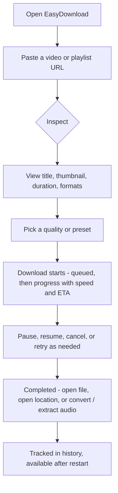
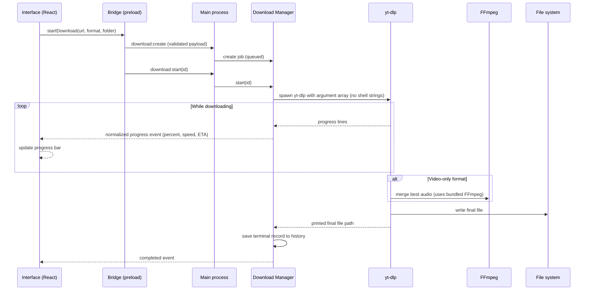
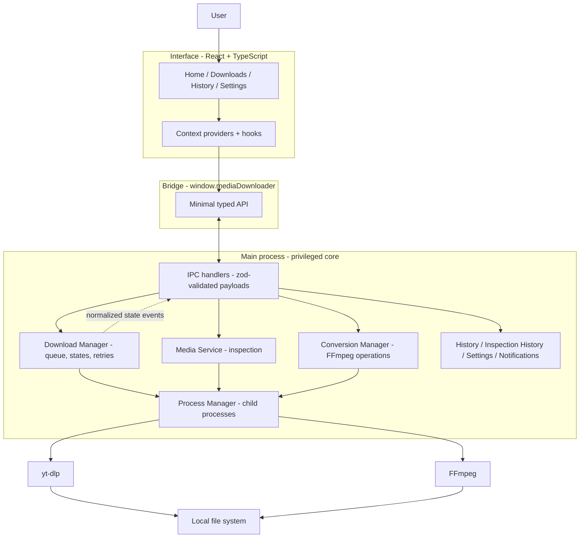
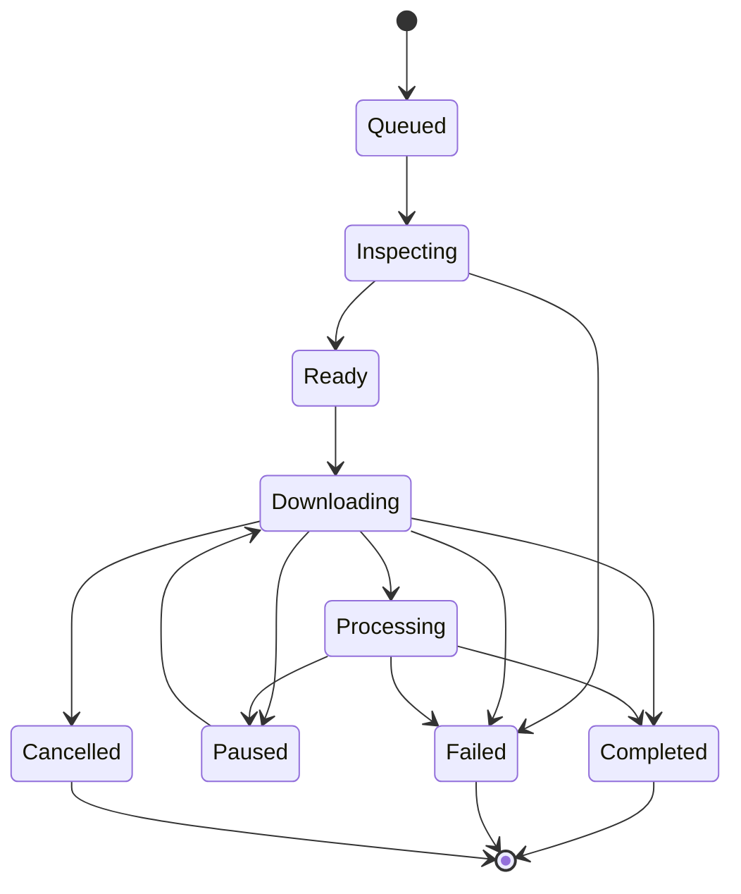
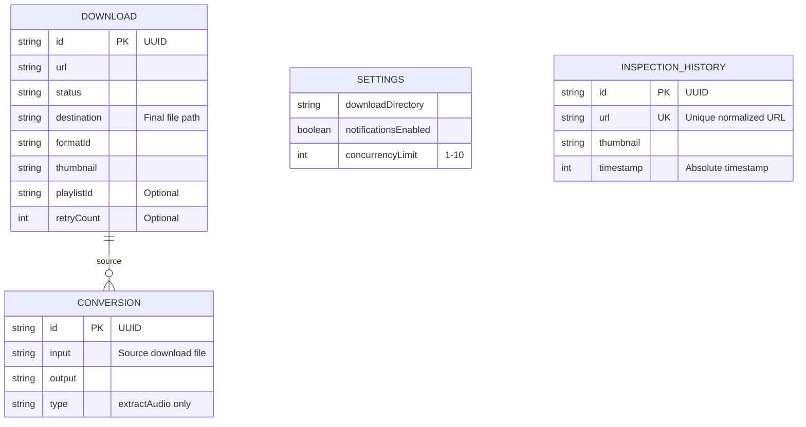

A local-first desktop application that downloads online videos and audio directly to your device — with a clean interface on top of the yt-dlp download engine and FFmpeg media processing.

---

## Overview

EasyDownload is a cross-platform desktop app (Windows, macOS, Linux) for saving online media to your computer. You paste a video or playlist link, the app shows you the video's details and the available qualities, you pick one, and the file downloads to a folder you choose — with progress, pause/resume, retry, history, and even post-download conversion (MP4/MKV) or audio extraction (MP3/AAC/Opus/FLAC).

Everything runs **on the user's own device**. There is no cloud service, no account, and no third-party server involved in the download. The two tools that do the heavy lifting (yt-dlp for downloading, FFmpeg for media processing) are bundled inside the installer, so the user never installs or configures anything.

## The Problem

Downloading videos from sites like YouTube is genuinely awkward for most people:

- **Web-based download services** ask you to paste the link into a website, which uploads your URL to a third-party server — a privacy concern — and typically limits size or shows ads.
- **Command-line tools** like yt-dlp are powerful but intimidating. Non-technical users should not have to learn terminal syntax, format selectors, or how to install and configure FFmpeg.
- **Manual workflows break down** on bigger tasks: no queue, no visible progress, no history, and no way to pause a large download and resume it later.

## The Solution

EasyDownload wraps the yt-dlp engine and FFmpeg processing behind a desktop GUI that manages the whole lifecycle:

1. **Validate** the URL before doing anything.
2. **Inspect** the media without downloading it — show title, thumbnail, duration, and every available quality as understandable choices.
3. **Download** with a queue, live progress (percent, speed, ETA), pause/resume, cancel, and retry.
4. **Organize** — history that survives restarts, day-grouped lists, and playlist folders.
5. **Process** — convert a finished download to another format or extract its audio.

The user experience is the point: the interface of a modern desktop app, the power of command-line tools, none of the setup.

## Key Features

### URL inspection before downloading

Paste a link and see the video's title, thumbnail, duration, and all available formats — labeled like "1080p MP4" rather than raw technical IDs.

**Why it matters:** Users know exactly what they will get before committing bandwidth or disk space, and never have to interpret cryptic format codes.

### Download queue with adjustable concurrency

Multiple downloads can run at once — the user controls how many (1–10) in settings. Pausing, cancelling, or failing one download automatically starts the next queued one.

**Why it matters:** Large batches (e.g. a playlist) become a fire-and-forget task instead of babysitting one download at a time.

### Pause, resume, cancel, and retry

Pausing keeps partial files and resumes where it left off; cancelling cleans up; retrying restores the original settings — including for downloads loaded from history after an app restart.

**Why it matters:** Big files and flaky connections stop being deal-breakers.

### Automatic retry for transient network failures

Downloads that fail with rate-limit or network errors (HTTP 403/429/5xx, connection resets) are retried automatically up to four times with escalating waits (2s/4s/8s/16s). Permanent failures — private, geo-blocked, or removed videos — are never retried.

**Why it matters:** The app recovers from throttling and hiccups without user intervention, while never wasting time on hopeless cases.

### Playlist downloads

A playlist link downloads the whole list at one chosen quality (Best / 1080p / 720p / 480p / 360p / Audio). Entries are saved into a playlist-named folder, download one at a time per playlist (to avoid rate limits), show aggregate progress, and can be cancelled as a group. Entries that fail individually don't block the rest, and already-downloaded videos are skipped on re-runs.

**Why it matters:** The most common real-world request — "save this whole playlist" — becomes one click.

### Post-download conversion and audio extraction

Completed videos can be converted to MP4 or MKV, or have their audio extracted as MP3/AAC/Opus/FLAC — with progress, cancellation, and persisted results.

**Why it matters:** Users can turn a video into the format their device or workflow actually needs, without separate tools.

### Persistent history and inspection records

Downloads (completed/failed/cancelled) and every inspected URL survive restarts, with per-entry delete, clear-all, retry, file sizes, thumbnails, and day-grouped lists (Today / Yesterday / date).

**Why it matters:** The app remembers what you did — nothing is lost on restart, and old records are easy to find or clean up.

### No duplicate downloads

Starting a download for a video and format that was already completed is rejected with a clear message.

**Why it matters:** Users don't accidentally re-download the same file and clutter their disk.

### Optional desktop notifications

Completion and failure notifications, controllable from settings.

**Why it matters:** Users can do other things and still know when a batch finished.

## User Experience

The app is organized around a single collapsible sidebar: **Home** (inspect and start downloads), **Downloads** (all, queue, completed, cancelled, failed — each with live count badges), **History** (previously inspected URLs), and **Settings** (download folder, notifications, concurrency).

The primary flow:



Details that matter for day-to-day use:

- **Live progress** — percent, downloaded size, speed, and ETA come from parsed tool output, normalized by the main process (UI only ever sees structured data).
- **Clear statuses** — every download is in one of eight states (queued, inspecting, downloading, processing, paused, completed, failed, cancelled) shown via badges, and section counts update live.
- **Graceful degradation** — missing thumbnails show a placeholder, legacy history records without metadata still work, and empty sections show a helpful message.
- **Accessible controls** — icon-only actions carry accessible names and tooltips; the sidebar collapses to an icon rail when screen space is tight.

## How It Works

Under the hood, EasyDownload is a desktop app with three cooperating layers: the **interface** (React), a thin **bridge** (preload), and a **privileged core** (the Electron main process) that owns everything risky — running programs, reading/writing files, showing system dialogs.

When the user clicks Download, this happens:



Two things make this interesting:

- **The interface never touches the download engine or the file system.** Every privileged operation flows through a small, explicit, validated API. This is a security boundary, not bureaucracy — it means a compromised interface can't run commands on the machine.
- **Progress is normalized at the source.** The main process parses raw yt-dlp output into a simple progress model; the interface never sees tool-speak.

## Architecture



The major parts, in simple terms:

- **Interface (renderer)** — the React UI. It knows how to present data and collect user input, and nothing else.
- **Bridge (preload)** — a tiny, hand-written API surface (`window.mediaDownloader`) that is the only door between the interface and the core. It exposes a few dozen deliberate functions — not the whole operating system.
- **Main process (privileged core)** — where the real work happens, split into small services with one job each: a Download Manager (queue and state machine), a Media Service (inspection), a Conversion Manager (FFmpeg conversions), a Process Manager (spawning and supervising child processes), and the persistence/notification services.
- **yt-dlp and FFmpeg** — the external engines, launched as child processes with safe argument arrays and managed by the app.
- **Local storage** — small JSON files in the OS user-data directory; no database, no cloud.

## Technical Implementation

### Frontend

- **React 19 + TypeScript** (strict typechecking across separate `tsconfig` projects for node and web code). No UI framework — plain CSS (`styles.css`) with a hand-built sidebar shell.
- **No routing library.** The app switches top-level sections (`home`, download sections, `history`, `settings`) through component state in `App.tsx`, which is appropriate for a single-window desktop app.
- **No state-management library.** Client-side state uses React context (`HomeStateProvider`, `HistoryStateProvider`) and custom hooks — deliberate, given the small state surface.

### State Management

Two kinds of state exist, with a clear split:

- **Renderer state (in memory):** the current URL, the cached inspection result per normalized URL (so navigating away and back doesn't re-inspect), the download-button busy state, and the inspection-history list shown in the sidebar.
- **Main-process state (source of truth):** the download jobs, their states, progress, processes, and persisted records. The renderer mirrors it through a single `useDownloads` hook that subscribes to `download:state` / `download:deleted` events and reconciles the list.

The design rule: the interface never assumes a local change succeeded — the main process is authoritative for anything involving processes or files.

### Data Fetching and Communication (IPC)

There is no HTTP API — the "API" is the Electron IPC layer between the interface and the main process:

- **Explicit channels, no generic IPC.** Each operation has its own channel (`download:pause`, `playlist:cancel`, `conversion:start`, …) with a defined input and output; there is no generic "run anything" command.
- **Validated payloads.** Every request is parsed at the boundary by a strict [zod](https://zod.dev) schema (types, URL format, enums, ranges). Invalid input is rejected before reaching a service.
- **Structured results.** Handlers return `{ ok: true, data } | { ok: false, error }` instead of throwing exceptions across the process boundary; errors are mapped to a typed taxonomy (`ValidationError`, `DependencyError`, `DownloadError`, `FilesystemError`, …) so the UI shows a useful message, never a stack trace.
- **Event-driven progress.** Long-running operations broadcast normalized state to all windows (percent, size, speed, ETA); raw tool output never leaves the main process.

### Backend: the Main Process

The desktop equivalent of a backend, running on the user's machine:

- **Service layer** — eleven single-purpose services (Download Manager, Media Service, Process Manager, File Manager, Dependency Manager, Settings Manager, History Manager, Inspection History Manager, Notification Manager, FFmpeg Service, Conversion Manager), composed in one factory with dependency injection, which is what makes the whole core unit-testable with mocked dependencies.
- **External tool orchestration** — all yt-dlp and FFmpeg invocations are `spawn(executable, args[])` argument arrays, never shell strings; output is parsed and normalized in exactly one place (the yt-dlp / FFmpeg services).
- **Binary management** — yt-dlp and FFmpeg are fetched at build time into `resources/bin/` and resolved at runtime (packaged path first, PATH fallback); the bundled FFmpeg directory is passed to yt-dlp via `--ffmpeg-location`.
- **Download state machine** — a documented, tested lifecycle:



- **Concurrency that is actually enforced** — the Download Manager limits simultaneous work to the configured setting (1–10), reads it on every queue drain, and isolates per-download state, processes, and cleanup. Playlist entries are additionally serialized per playlist (at most one active at a time) to avoid host rate-limiting.

### Storage (no database)

Persistence is four small JSON files in the Electron user-data directory, owned by main-process stores:



Notable design decisions:

- **Metadata-only deletion** — deleting a history entry removes the record (and linked conversion metadata), never the files on disk.
- **Backward-compatible records** — features were added as optional fields on existing records; legacy records render with fallbacks and remain fully functional.
- **Self-healing paths** — completed records whose file disappeared are pruned on load; records missing a stored path are repaired by matching a unique file in the download directory.
- **Unique inspection history** — one entry per normalized URL, refreshed in place, with a rolling 30-day retention window.

### UI / UX

- Desktop window (default 1100×750, min 800×600) with a collapsible sidebar (full → icon rail).
- Live count badges per download section, day-grouped lists with Today/Yesterday/date headers, and inline aggregate progress for playlists.
- Reusable components (`StatusBadge`, `MediaThumbnail`, `EmptyState`, `HistorySection`, `ConversionControl`, …) shared across pages.
- Graceful fallbacks everywhere data can be missing (no thumbnail, legacy records, empty lists).
- Accessibility basics on icon-only actions: accessible names and tooltips.

### SEO

Not applicable — this is a desktop application with no web presence. (There is no website or landing page in the repository.)

### Performance

No benchmarks exist in the repository; the implementation characteristics are:

- **Non-blocking UI** — all long-running work runs in child processes supervised by the main process; the renderer only receives small normalized events.
- **Configurable concurrency with central enforcement** — parallelism is bounded by user setting, and per-playlist serialization plus transient-retry backoff are designed around real host rate-limiting behavior.
- **Lazy, serialized persistence** — history stores load on first access; writes are chained so they never interleave; persistence failures never break the download workflow.
- **Inspection cache** — Home page results are cached per normalized URL in memory, avoiding repeated yt-dlp inspections while navigating.

### Testing

A real test suite with **371 tests, all passing** (255 unit, 10 integration, 106 renderer — verified by running `npm test`):

- **Unit tests** cover URL validation, format normalization, yt-dlp/FFmpeg output and progress parsing, argument construction, download state transitions, error mapping, and path safety.
- **Integration tests** exercise the Process Manager against mocked executables — no live network, no real binaries required.
- **Renderer tests** cover pages, components, and navigation flows with React Testing Library.
- **Honest gap:** end-to-end tests are not configured (the `test:e2e` script explicitly says so).

## Architecture Decision Records

The repository documents its decisions in `docs/ADR/` (nine records). The six decisions below are the ones that most shaped the project; each is summarized from the repository's ADR or, where the repository does not record a rationale, explicitly marked as inferred from the implementation.

### ADR-1: Electron as the desktop framework

**Status:** Accepted (repository ADR-003)

**Context:** The app must run on Windows/macOS/Linux, manage long-running child processes, interact with the OS (filesystem, dialogs, notifications), and host a React UI — all locally.

**Decision:** Use Electron: a Node.js main process for privileged work, a Chromium renderer for the React UI, a preload bridge between them, and electron-builder for packaging.

**Why:** One codebase across three platforms; the Node.js main process naturally manages yt-dlp/FFmpeg subprocesses; mature packaging and distribution tooling.

**Alternatives considered:** Native per-platform apps (three codebases — rejected for maintenance cost), a web app (no local process/filesystem capability — incompatible with the local-first requirement), Tauri (smaller binaries, but a Rust backend that diverges from the chosen stack).

**Trade-offs:** Larger installers and higher memory use than native apps; all privileged work must be routed through the main process, which adds a security surface to maintain (see ADR-4).

### ADR-2: Local-first architecture with JSON-file persistence

**Status:** Accepted (repository ADR-004; persistence approach inferred from the implementation)

**Context:** The product must work without accounts, a remote API, a cloud database, or cloud storage — an internet connection is needed only to fetch the media itself.

**Decision:** The core workflow (inspect → download → process → save) runs entirely on the user's machine. Settings and history persist as small JSON files in the OS user-data directory.

**Why:** Zero infrastructure to build or secure; user content and browsing history never leave the device; the data volumes (settings, download records, inspection history) are small enough that a JSON store is simpler and more inspectable than a database.

**Alternatives considered:** Cloud-backed downloader (contradicts the product goal and adds privacy/infrastructure cost), hybrid local+cloud (complexity beyond scope).

**Trade-offs:** No cross-device sync; downloads limited by the local machine's network and disk; the app must bundle its tools so local-first doesn't burden the user (ADR-3).

### ADR-3: Bundle yt-dlp and FFmpeg at build time

**Status:** Accepted (repository ADR-001, ADR-002)

**Context:** The app depends on two command-line tools users should never install themselves — and yt-dlp needs no Python runtime when the standalone binary is used.

**Decision:** Build scripts download the platform-appropriate binaries into `resources/bin/`; electron-builder packages them as `extraResources`; a runtime resolver finds the bundled binary (packaged or dev tree) with a PATH fallback.

**Why:** Users get a working, offline-capable app out of the box; dependency availability is deterministic for packaged builds.

**Alternatives considered:** Requiring a system-installed yt-dlp via PATH (fails for users who can't or won't install it), runtime self-managed download (needs network on first launch and adds update/integrity handling).

**Trade-offs:** The binaries add roughly 15–20 MB to the installer; each release must refresh them; bundled binaries aren't covered by code signing (a macOS Gatekeeper consideration).

### ADR-4: Isolate the tools behind dedicated services with safe argument arrays

**Status:** Accepted (repository ADR-005, ADR-006)

**Context:** yt-dlp and FFmpeg are powerful CLIs with unstructured output and a large option set; their input (URLs, format IDs, filenames) must be treated as untrusted.

**Decision:** All interaction flows through one service per tool, which owns argument construction (`spawn(executable, args[])` — never shell strings), output parsing, progress normalization, error mapping, and cancellation.

**Why:** One integration point means flag changes affect one module; security-sensitive argument handling is centralized and testable; nothing else in the app depends on tool CLI syntax.

**Alternatives considered:** Calling the tools directly from wherever needed (couples many modules to CLI syntax and spreads security-sensitive handling — rejected).

**Trade-offs:** The services must track tool output formats across versions; adding a new capability means extending a service and its tests.

### ADR-5: Electron security model — privileged core, unprivileged UI

**Status:** Accepted (repository ADR-007)

**Context:** The renderer runs application content that must never reach Node.js, the filesystem, or child processes.

**Decision:** `contextIsolation: true`, `nodeIntegration: false`; a minimal preload API (`window.mediaDownloader`) that never exposes `ipcRenderer`, `shell`, `fs`, `child_process`, `process`, or `require`; explicit IPC channels with zod-validated payloads; new windows denied (`setWindowOpenHandler` returns `{ action: 'deny' }`), external links only via `shell.openExternal`.

**Why:** Defense in depth — a compromised or remote-loaded renderer stays isolated from the OS; every privileged operation has an explicit, auditable contract.

**Alternatives considered:** A relaxed model (enabling Node integration or exposing raw `ipcRenderer` for convenience) — rejected as it dramatically widens the attack surface.

**Trade-offs:** All privileged work must be routed through the main process with no escape hatch; the preload/IPC surface must stay minimal and reviewed. (Known hardening gap, documented in the ADR: the Chromium sandbox is currently disabled — `sandbox: false` — with enabling it tracked as future work.)

### ADR-6: Playlists fan out into ordinary per-video download jobs

**Status:** Accepted (repository ADR-009)

**Context:** Users need to download whole playlists, but playlist entries don't share format IDs (each video has its own formats) and may include private/geo-blocked entries.

**Decision:** A playlist becomes a set of ordinary per-video download jobs tagged with playlist metadata and a quality preset. Format resolution happens per entry at download time; entries save into a sanitized playlist subfolder; the existing queue, concurrency, history, retry, pause/cancel, and file actions apply unchanged.

**Why:** Reuses the proven Download Manager wholesale instead of building a parallel playlist subsystem; per-video failures are naturally isolated; records stay backward compatible (only optional fields added).

**Alternatives considered:** One yt-dlp process per playlist with a single record (loses per-video history/actions and makes cancel all-or-nothing), a first-class playlist entity (most flexible but a large change to the download model and persistence — rejected).

**Trade-offs:** A large playlist creates one job and one history record per video; re-running a playlist can't upgrade an earlier lower-quality download without deleting the old entry; an unavailable preset surfaces as per-entry failures rather than a pre-flight error.

## Challenges & Solutions

### Challenge: Non-ASCII filenames corrupted on Windows

**Problem:** yt-dlp writes its output on Windows in the ANSI code page, so videos with Arabic (or other non-ASCII) titles recorded garbled destination paths that didn't match the real file — "Open file" broke.

**Solution:** yt-dlp is now invoked with `--encoding utf-8` (inspection and download), and streamed child output is decoded with a `StringDecoder` so multi-byte characters split across chunks are never corrupted.

**Result:** Non-ASCII titles and paths survive end to end on Windows.

### Challenge: Concurrent downloads raced during scheduling

**Problem:** Starting a second download while the first was still being scheduled could let a scheduler pass pick up a not-yet-started job and fail it with `Cannot start a download in state "inspecting"`.

**Solution:** `create` no longer enqueues a job — only `start`/`resume`/`retry` do — plus status guards, queue re-entry guards, and an active-execution guard that defers a re-queued job until its previous process has fully exited. A regression test covers the scenario.

**Result:** Starting the same download twice can never create a second process, and concurrent downloads no longer fail spuriously.

### Challenge: Same video at different qualities collided on one file

**Problem:** The output template was `%(title)s [%(id)s].%(ext)s`, so downloading the same video at two qualities produced two jobs writing the same file — appearing as ghost/duplicate entries.

**Solution:** The template now embeds the selected format ID (`%(title)s [%(id)s] [<format>].%(ext)s`), while downloads keep UUID-based identity end to end.

**Result:** Every job writes its own distinct file.

### Challenge: Completed downloads lost their file path, breaking file actions

**Problem:** "Open file", "Open File Location", and Convert sometimes had no destination to act on.

**Solution:** yt-dlp is asked for the final path via `--print after_move:filepath` (authoritative), with `Destination:`/`Merger` output-line parsing as fallback; the manager derives and verifies the path against the filesystem when capture still fails, and backfills missing paths on history load by matching a unique file in the download directory.

**Result:** File actions work for every completed download, including legacy records.

### Challenge: YouTube rate-limiting under concurrent/playlist downloads

**Problem:** Parallel requests to the same host triggered HTTP 403 responses and stalled downloads.

**Solution:** Playlist entries are serialized per playlist (at most one active at a time, regardless of the global concurrency limit), and downloads that fail with transient errors (403/429/5xx, connection resets/timeouts) are auto-retried up to four times with escalating backoff (2s/4s/8s/16s) before being marked failed.

**Result:** Playlist fan-out tolerates host throttling; permanent failures (private/geo-blocked/removed) are never retried.

### Challenge: FFmpeg falsely reported as unavailable

**Problem:** The availability check ran `ffmpeg --version`, which FFmpeg treats as an error (exit code 8), so audio merging always failed with a "dependency missing" error.

**Solution:** The check now uses `ffmpeg -version`, matching the yt-dlp check pattern; dependency-manager unit tests were added.

**Result:** Bundled FFmpeg is correctly detected and video-only downloads merge audio reliably.

## Technology Stack

| Technology | Purpose |
| --- | --- |
| Electron | Desktop framework: main process, secure IPC, native dialogs, notifications, packaging |
| React + TypeScript | User interface with strict type safety |
| electron-vite (Vite 7) | Dev/build tooling for main, preload, and renderer bundles |
| zod | Runtime validation of every IPC payload and settings |
| yt-dlp | Media inspection and download engine (bundled, PATH fallback) |
| FFmpeg | Audio merging and post-download conversion / audio extraction (bundled) |
| JSON-file stores | Settings and history persistence in the OS user-data directory |
| Vitest + React Testing Library | Unit, integration, and renderer tests |
| electron-builder | Installers: NSIS (Windows), DMG (macOS), AppImage (Linux) |
| GitHub Actions | Release workflow: test, package, and publish the Windows installer |

## Project Structure

```text
src/
├── main/            → Privileged core: IPC handlers, services, process management
│   ├── ipc/         → IPC channel registration (zod validation, structured results)
│   └── services/    → Download, Media, Process, File, Settings, History,
│                      InspectionHistory, Notifications, FFmpeg, Conversion, Dependencies
├── preload/         → The only bridge between UI and core (window.mediaDownloader)
├── renderer/        → React UI
│   ├── pages/       → Home, Downloads, History, Settings
│   ├── components/  → Reusable UI (Sidebar, StatusBadge, EmptyState, ...)
│   ├── hooks/       → useDownloads, useMediaDownloader
│   ├── state/       → HomeStateProvider, HistoryStateProvider
│   └── services/    → Preload API access
└── shared/          → Contracts shared by both sides
    ├── types/       → Download, MediaInfo, settings, IPC result types
    ├── schemas/     → zod schemas
    └── constants/   → IPC channel names, defaults

scripts/             → Build-time binary downloads (yt-dlp, FFmpeg), icon extraction
tests/integration/   → Integration tests (Process Manager with mocked executables)
docs/                → Requirements, architecture, testing strategy, ADRs
.github/workflows/   → Release workflow (version-tag-triggered)
```

## Security

All verified in the code:

- **Context isolation with Node integration disabled** — `contextIsolation: true`, `nodeIntegration: false`; the interface cannot reach Node.js, the filesystem, or child processes.
- **Minimal preload API** — only the typed `window.mediaDownloader` bridge is exposed; `ipcRenderer`, `shell`, `fs`, `child_process`, `process`, and `require` are never exposed.
- **Validated IPC** — strict zod schemas reject invalid payloads before they reach a service.
- **No shell command construction** — external tools run as `spawn(executable, args[])`; URLs, format IDs, filenames, and paths are treated as untrusted input.
- **URL validation** — URLs must parse as `http:`/`https:` before being passed to yt-dlp.
- **Constrained conversions** — the interface sends only a source file and a structured operation; the main process derives the output path next to the source, so conversions can't write elsewhere or pass raw codec argument strings.
- **Navigation hardening** — new windows are denied; external links open only through `shell.openExternal`.
- **Typed error surfaces** — the interface receives structured error objects, never internal exceptions or stack traces.

## Deployment

- **Packaging:** electron-builder produces an NSIS installer for Windows, a DMG for macOS, and an AppImage for Linux (`npm run dist:win|mac|linux`). yt-dlp and FFmpeg binaries are fetched at build time and bundled as `extraResources`, so the installer is self-contained. Icons are generated from a source PNG via `electron-icon-builder`.
- **Releases:** a GitHub Actions workflow triggers on version tags (`v*`), verifies the tag matches `package.json`, runs typecheck and the full test suite, packages the Windows installer, and uploads it to a GitHub Release with auto-generated notes.
- **Scope note:** the release workflow currently covers Windows only; macOS/Linux packaging is configured but not yet released.
- **No secrets:** the workflow uses only the repository's default `GITHUB_TOKEN`; no API keys or credentials are required to build or release.

## What This Project Demonstrates

### Product / Business perspective

- **Requirement-to-feature translation** — every feature traces to a written requirement (FR-001…FR-020) with priorities and explicit out-of-scope boundaries.
- **A real user problem, solved locally** — privacy-conscious offline downloading without command-line tools, with the setup burden removed by bundling dependencies.
- **UX judgment** — understandable format labels instead of raw IDs, day-grouped history, live status counts, playlist presets, graceful handling of missing data.

### Engineering perspective

- **Secure Electron architecture** — a genuinely constrained renderer/preload/main boundary with validated IPC and structured errors, documented as a decision record.
- **Concurrent job scheduling** — a state-machine Download Manager with configurable concurrency, pause/resume, retries (manual and automatic with backoff), and race conditions explicitly handled and regression-tested.
- **Safe external-tool integration** — argument arrays, no shell strings, output normalized in one place, binaries bundled at build time with runtime resolution.
- **Backward-compatible data evolution** — persistence that grew metadata, playlist tags, and conversion records without breaking existing data.
- **Resilience engineering** — Windows encoding, host rate-limiting, transient network failures, and missing dependencies all handled deliberately.
- **Real testing discipline** — 371 unit/integration/renderer tests that run offline with mocked executables, plus an honest statement of the missing E2E layer.
- **Documentation as engineering output** — requirements, architecture, testing strategy, and nine ADRs maintained alongside the code.

## Future Improvements

Not implemented — realistic next steps given the current architecture:

- Enable the Chromium sandbox and add a `will-navigate` guard (documented hardening candidates).
- Configure end-to-end tests (Playwright) for critical download workflows.
- Proxy configuration (FR-018) and dependency auto-update detection (FR-019) — deferred by design.
- Windows application auto-updates (the release workflow already uploads the installer).
- Extend the release workflow to macOS/Linux.
- Add a repository README (the project currently documents itself through `docs/`).

## Links

- [GitHub repository](https://github.com/Abo3baziz/EasyDownload)
- Project documentation: `docs/REQUIREMENTS.md`, `docs/ARCHITECTURE.md`, `docs/TESTING.md`, `docs/ADR/`

No live demo or public API exists — this is a desktop application with no remote backend by design.
